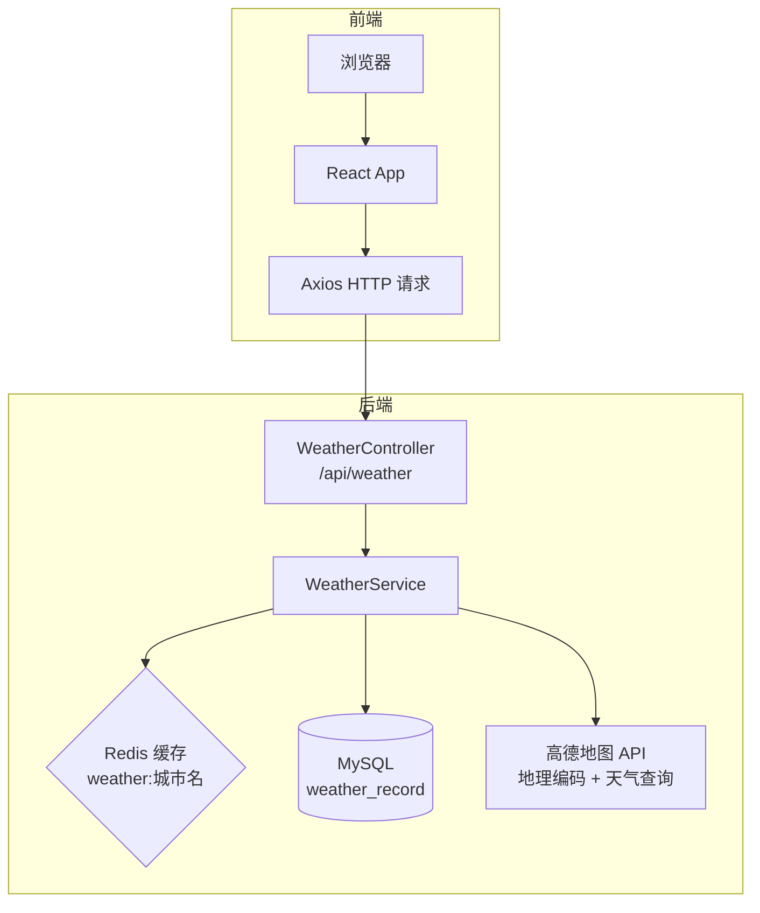

# Weather Forecast

一个基于 **Spring Boot 3.2 + React 18** 的天气预报应用，使用高德地图 API 获取实时天气数据，集成 **Redis 缓存加速** 和 **MySQL 查询记录持久化**。

## 技术栈

### 后端
- **Spring Boot 3.2** (Java 21)
- **WebClient** — 异步调用高德地图 API
- **Redis** — 天气查询缓存（TTL 10分钟）
- **MySQL + JPA** — 查询记录持久化
- **全局 CORS 配置 + 全局异常处理器**

### 前端
- **React 18** + **Axios**
- 实时天气展示（温度、湿度、风力、体感温度）
- 天气图标映射（晴/多云/雨/雪/雾等）

### 部署
- **Docker** + **Nginx**（前端反向代理至后端）
- **GitHub Actions**（CI：编译 + 测试 + Docker 构建）

## 系统架构



**查询流程：**
> 请求到达 → 查 Redis 缓存 → 命中直接返回 → 未命中调高德 API → 写入 Redis（TTL 10 分钟）→ 写入 MySQL → 返回

## 项目结构

```
weather/
├── .github/workflows/
│   └── ci.yml                    # GitHub Actions CI 配置
├── backend/
│   ├── Dockerfile
│   ├── pom.xml
│   └── src/main/java/com/weather/
│       ├── WeatherApplication.java
│       ├── config/
│       │   ├── RedisConfig.java   # Redis 序列化配置
│       │   └── WebConfig.java     # 全局 CORS 配置
│       ├── controller/
│       │   ├── WeatherController.java      # /api/weather 接口
│       │   └── GlobalExceptionHandler.java # 全局异常处理
│       ├── model/
│       │   ├── WeatherResponse.java        # 天气响应 DTO
│       │   └── WeatherRecord.java          # JPA 实体
│       ├── repository/
│       │   └── WeatherRecordRepository.java
│       └── service/
│           └── WeatherService.java         # 核心业务（缓存 + API + 持久化）
├── frontend/
│   ├── Dockerfile
│   ├── nginx.conf                 # Nginx 反向代理配置
│   ├── package.json
│   └── src/
│       ├── App.jsx               # 主页面（搜索 + 展示）
│       ├── App.css               # 样式
│       ├── index.js
│       └── components/
│           └── WeatherCard.jsx   # 天气卡片组件
└── README.md
```

## 前置条件

- **JDK 21+**
- **Node.js 18+**
- **Redis**（默认 `localhost:6379`）
- **MySQL 8.0+**（默认 `localhost:3306`，需手动创建数据库）

快速安装 Redis 和 MySQL：

```powershell
# 安装 Redis
winget install Redis.Redis

# 安装 MySQL
winget install Oracle.MySQL

# 初始化 MySQL 并创建数据库
& "C:\Program Files\MySQL\MySQL Server 8.4\bin\mysqld.exe" --initialize-insecure --datadir="$env:USERPROFILE\mysql-data"
Start-Process -FilePath "C:\Program Files\MySQL\MySQL Server 8.4\bin\mysqld.exe" -ArgumentList "--datadir=$env:USERPROFILE\mysql-data","--port=3306" -WindowStyle Hidden
& "C:\Program Files\MySQL\MySQL Server 8.4\bin\mysql.exe" -u root -e "ALTER USER 'root'@'localhost' IDENTIFIED BY 'root'; CREATE DATABASE weather_db CHARACTER SET utf8mb4 COLLATE utf8mb4_unicode_ci;"
```

## 快速开始

### 1. 创建数据库（仅首次）

```powershell
& "C:\Program Files\MySQL\MySQL Server 8.4\bin\mysql.exe" -u root -proot -e "CREATE DATABASE IF NOT EXISTS weather_db CHARACTER SET utf8mb4 COLLATE utf8mb4_unicode_ci;"
```

### 2. 启动后端（端口 8080）

```powershell
cd backend
mvn clean package -DskipTests
java -jar target\weather-backend-0.0.1-SNAPSHOT.jar
```

### 3. 启动前端（端口 3000）

```powershell
cd frontend
npm install
$env:REACT_APP_API_URL="http://localhost:8080/api"
npm start
```

### 4. 访问

打开浏览器访问 `http://localhost:3000`，输入城市名称（如"北京"）即可查询天气。

### 接口测试

```powershell
Invoke-RestMethod "http://localhost:8080/api/weather?city=上海"
```

查看 MySQL 查询记录：

```powershell
& "C:\Program Files\MySQL\MySQL Server 8.4\bin\mysql.exe" -u root -proot weather_db -e "SELECT * FROM weather_record;"
```

## Docker 部署

```bash
docker-compose up -d
```

> 仅部署后端和前端，Redis 和 MySQL 需额外配置。

## 环境变量

| 变量 | 说明 | 默认值 |
|------|------|--------|
| `AMAP_API_KEY` | 高德地图 API 密钥 | `299528262e805387dfa5ca56de19e7b4` |
| `REACT_APP_API_URL` | 后端 API 基础地址 | `http://localhost:8080/api` |
| `spring.datasource.username` | MySQL 用户名 | `root` |
| `spring.datasource.password` | MySQL 密码 | `root` |

> 高德 API 密钥在 [application.properties](backend/src/main/resources/application.properties) 中配置。

## API 接口

### `GET /api/weather?city={城市名称}`

**响应示例：**

```json
{
    "city": "北京",
    "description": "晴",
    "temperature": 25.0,
    "feelsLike": 25.0,
    "humidity": 30,
    "windSpeed": "≤3级",
    "icon": "sunny"
}
```

## 功能特性

- ✅ 实时天气查询（温度、湿度、风力、体感温度）
- ✅ Redis 缓存加速（10 分钟 TTL，减少 API 调用）
- ✅ MySQL 查询记录持久化（每次查询自动保存）
- ✅ 高德地图地理编码（自动将城市名转为 adcode）
- ✅ 全局 CORS 配置（支持前后端分离开发）
- ✅ 统一的异常处理（前端可读的错误消息）
- ✅ 响应式 UI 设计
- ✅ Docker 容器化部署
- ✅ GitHub Actions 持续集成
